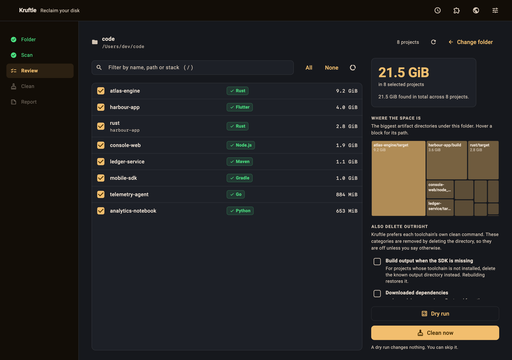

<h1 align="center">Kruftle</h1>

<p align="center">
  
</p>

<p align="center">
  <em>Reclaim your disk. Kill the cruft.</em>
</p>

<p align="center">
  <a href="https://github.com/dizitart/kruftle/releases"></a>
  <a href="LICENSE"></a>
  
</p>

<p align="center">
  <a href="https://kruftle.dizitart.com"><strong>kruftle.dizitart.com</strong></a>
  &nbsp;·&nbsp;
  <a href="https://github.com/dizitart/kruftle/releases">Download</a>
  &nbsp;·&nbsp;
  <a href="https://kruftle.dizitart.com/docs/">Manual</a>
</p>

---

<p align="center">
  
</p>

A developer machine accumulates build output the way a workshop accumulates
sawdust. A `target/` here, a `node_modules/` there, a `build/` in every Flutter
app — none of it precious, all of it invisible, and collectively tens of
gigabytes.

**Kruftle** scans a directory, works out what every project underneath it is
built with, and reclaims that space by running each toolchain's *own* clean
command.

- `cargo clean` for Rust crates
- `flutter clean` for Flutter apps
- `mvn clean` for Maven projects
- `./gradlew clean` for Gradle projects
- `go clean` for Go projects
- `dotnet clean` for .NET projects
- `swift package clean` for Swift packages
- `mix clean` for Elixir projects

and so on, for 42 toolchains in total.

## Why the tool's own command

Because `rm -rf` on a guessed directory name is how people lose work.

`cargo clean` knows which files in `target/` are Cargo's. A shell glob does
not. Kruftle only ever deletes a directory outright when the SDK for that
project genuinely is not installed, the directory name is on a per-stack
allow-list, and you have ticked a box saying so for that run.

## What it does

- **Finds every project**, including the ones nested inside other projects —
  the Rust crate in a Flutter app has build output that `flutter clean` will
  never touch.
- **Detects the toolchain and whether it is installed**, so you know before you
  start which projects will get a proper clean and which are offered a fallback.
- **Dry run first**, with a real measurement of what would be freed. Or skip it.
- **Choose what runs.** Select all, none, or exactly the projects you mean.
- **Cleans in parallel**, projects at a time, and reports what was actually
  freed rather than what was predicted.
- **Logs everything** and exports it when you want to know what happened.

## Safety

Disk cleanup tools get one chance to earn trust. Kruftle:

- refuses to run on `/`, your home directory, or any system path, and that
  refusal cannot be waived
- refuses a path near the root of its drive too — but that one is a guess at
  intent, not a danger, so it asks instead: a mapped network drive or a mounted
  volume puts a real codebase at `Z:\` or `/mnt/work`, and Kruftle shows you
  the path and what a scan does, and proceeds only if you say so
- never follows a symlink, and never deletes through one
- deletes only directory names a matched stack explicitly declares — never a
  glob, never a pattern you typed
- re-checks every rule at the moment of deletion, not just when planning
- **skips anything git tracks**, because some repos commit their `build/` and a
  rebuild will not bring that back
- asks before every category of raw deletion, every run

Each of those has a test that fails closed.

## Supported stacks

**42 toolchains**, detected by marker file and cleaned with that toolchain's own
command.

| Family | Stacks |
|---|---|
| **Systems** | Rust · Go · Zig · Nim · Crystal · D · Fortran · Ada |
| **Native / C++** | CMake · Make · Bazel · Meson · Ninja · Autotools · Conan · vcpkg · PlatformIO |
| **JVM & .NET** | Maven · Gradle · sbt · Clojure · .NET |
| **Dart** | Flutter · Dart |
| **Apple** | Xcode · Swift Package |
| **Web & scripting** | Node.js · Deno · PHP / Composer · Python · Ruby · Perl |
| **Functional** | Haskell · Cabal · Erlang · Elixir · OCaml · Gleam |
| **Data & infra** | Julia · R · Terraform · Unity |

Adding another is one file and one list entry — see
[`lib/src/core/registry/`](lib/src/core/registry/). If your stack is missing,
[open an issue](https://github.com/dizitart/kruftle/issues/new?template=language_support.yml)
and it is usually a short PR away.

## Install

Download the build for your platform from
[Releases](https://github.com/dizitart/kruftle/releases).

- **macOS** — the `.dmg`; drag Kruftle to Applications. Only for the first
  install: updates after that replace the app in place, with no disk image.
- **Windows** — the `-setup.exe`. It installs for you alone, under
  `%LOCALAPPDATA%\Programs`, and needs no administrator. Add `/ALLUSERS` for a
  machine-wide install.
- **Linux** — the `.deb`, the `.AppImage` (`chmod +x` it first), or the
  `.tar.gz` unpacked anywhere you can write.

Builds are currently unsigned, so the first launch needs one extra step:

- **macOS** — `xattr -dr com.apple.quarantine /Applications/Kruftle.app`
- **Windows** — SmartScreen → *More info* → *Run anyway*

### Updating

Kruftle updates itself. It checks Releases at launch, offers the new version,
verifies the download against the release's published SHA-256, and unpacks it
over the installed copy when you restart — no installer, nothing to drag. You
can also ask at any time: **Settings → Updates → Check for updates now**.

The one case that still needs an installer is a copy installed somewhere you
cannot write — a machine-wide `C:\Program Files` install, or a `.deb` under
`/usr`. Those are offered their own packaging's installer instead, because
replacing those files needs a password and doing that behind a progress bar
would be worse than asking.

## Building from source

```bash
flutter pub get
flutter test
flutter run -d macos   # or -d windows, -d linux
```

## License

GPL-3.0-or-later. See [LICENSE](LICENSE).
